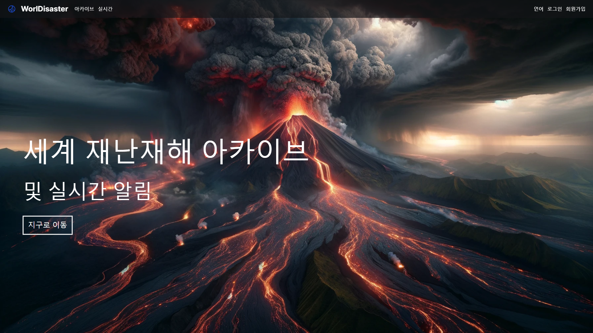
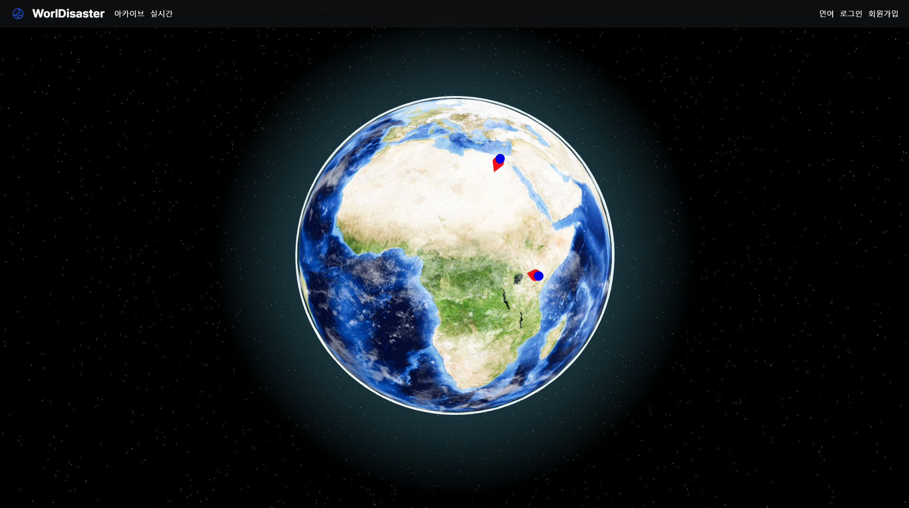
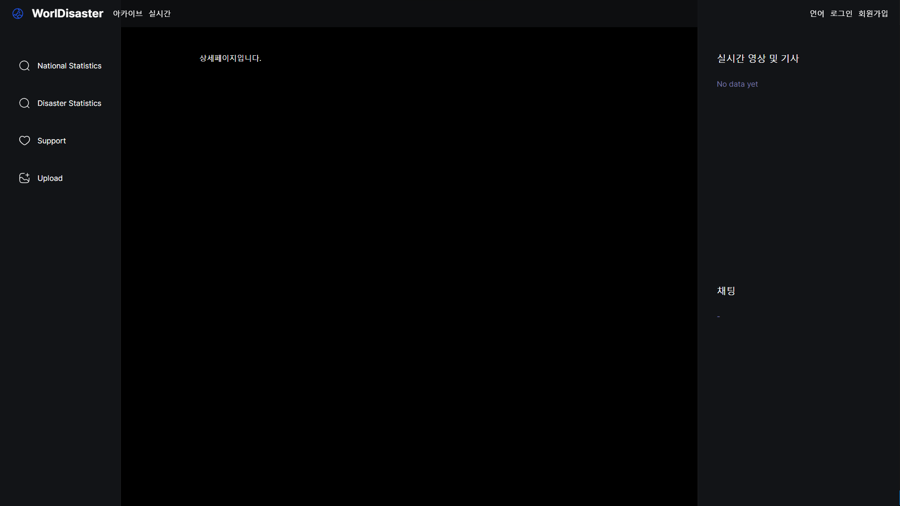

# 세계 재난재해 아카이브 및 실시간 정보 제공 서비스

- 기간  
2023.11.08 ~ 2023.12.16

- 멤버  
김호집(팀장/백엔드), 김기영(백엔드), 이유정(백엔드), 김지성(프론트엔드), 김초원(프론트엔드)

- 발표자료  
  - [💻 worldisaster.vercel.app
](https://worldisaster.vercel.app/)
  - [💭 PPT](https://www.canva.com/design/DAF0tEKl5s4/5FW-fzD3tG_Qkv4foBb7WQ/view?utm_content=DAF0tEKl5s4&utm_campaign=designshare&utm_medium=link&utm_source=editor)

 

- 우리는 어떤 문제를 해결하고자 했는가?  

- 우리 서비스는 특별히 어떤 기능이 있는가? 

- 시연/데모  

- 아키텍쳐 선정 이유  

 

## 🌌 메인페이지

### 1 아카이브
three.js로 구현된 지구 위에 API(reliefWeb,factbook,NewYorkTimes Archive API)로 제공된 약 3500여 개의 재난 정보를 국가 별로 확인할 수 있도록 클릭 이벤트 제공
 

-> 국가 클릭 시 상세 페이지로 이동

### 2 실시간
three.js로 구현된 지구 위에 API(Bing?미정)로 제공된 약 10-20여 개의 아직 끝나지 않은 재난 정보를 확인할 수 있도록 클릭 이벤트 제공
 

-> 국가 위에 생성 된 핀 클릭 시 상세페이지로 이동

 

## 🌎 상세페이지

- 초안

 

### 1 국가 별 통계
상황) 메인 페이지/아카이브 에서 지구 위 ⭐특정 국가⭐ 클릭 시 <상세 페이지 1 국가 별 통계> 탭으로 이동

- 해당 국가 정보 및 발생한 재난 상세 정보와 통계를 제공

### 2 재난 별 통계
상황) 메인페이지/실시간 에서 지구 위 ⭐핀⭐ 클릭 시 <상세 페이지 2 재난 별 통계> 탭으로 이동

- 실시간 재난 상세 정보 제공
- 실시간 기사 제공
- 채팅 기능 제공

 

## 🔍 그 외

- 후원 기능 제공
- 동영상 업로드 기능 제공
- 다국어 기능 제공 (영어/한국어)